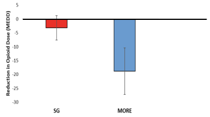

# Blog-hero Section - Tailwind CSS Classes

## Generated Tailwind Classes for the Blog-hero Design

### Container
```html
<div class="w-[1480px] border border-dashed border-[#8a38f5] rounded-[5px] p-8 flex flex-col gap-12">
```

### Header Section
```html
<div class="flex flex-col gap-4 text-center">
  <h1 class="font-inter text-[46px] font-extrabold tracking-[-0.92px] text-[#111928]">
    Our Blog
  </h1>
  <p class="font-inter text-[20px] font-normal text-[#6b7280]">
    Read the research and learn more about MORE
  </p>
</div>
```

### Charts Row
```html
<div class="flex gap-4 justify-between">
  
  
  
</div>
```

### Blog Cards Container
```html
<div class="flex gap-4 flex-wrap">
```

### Single Blog Card
```html
<div class="w-[405px] rounded-lg shadow-sm overflow-hidden flex flex-col">
  <!-- Card Header -->
  <div class="h-[180px] bg-gradient-to-br from-purple-900 to-purple-600"></div>
  
  <!-- Card Content -->
  <div class="p-8 flex flex-col gap-3 flex-1">
    <!-- Badge -->
    <span class="inline-block font-inter text-[12px] font-medium text-white bg-[#6b21a8] px-3 py-1 rounded w-fit">
      Research Paper
    </span>
    
    <!-- Title -->
    <h3 class="font-inter text-[20px] font-semibold tracking-[-0.40px] leading-[28px] text-[#111928] m-0">
      Quieting the Addicted Brain: Theta Waves, the Default Mode Network, and thePower of MORE
    </h3>
    
    <!-- Description -->
    <p class="font-inter text-[16px] font-normal leading-[24px] text-[#6b7280] m-0">
      For therapists working at the intersection of addiction, emotional distress, and chronic
      pain, the need for effective, evidencebased interventions has never been more urgent.
    </p>
    
    <!-- Author Section -->
    <div class="flex gap-3 items-start mt-auto">
      
      <div class="flex flex-col gap-0.5">
        <p class="font-inter text-[14px] font-medium text-[#111928] m-0">
          Dr. Eric Garland
        </p>
        <p class="font-inter text-[14px] font-normal text-[#6b7280] m-0">
          Aug 10, 2025 · 6 min read
        </p>
      </div>
    </div>
  </div>
</div>
```

### Card Header Color Variations
Each card has a header with a gradient background. The gradient can be adjusted per card:

```css
/* Research Paper Badge & Header */
.blog-card:nth-child(1) .blog-card-header {
  background: linear-gradient(135deg, #6b21a8 0%, #7c3aed 100%);
}

/* Blog Post Badge */
.blog-card:nth-child(2) .blog-card-badge,
.blog-card:nth-child(3) .blog-card-badge {
  background-color: #7c3aed;
}
```

## Font Import

Add to your global CSS or layout:
```css
@import url('https://fonts.googleapis.com/css2?family=Inter:wght@400;500;600;800');
```

Or use the font source provided: https://fonts.googleapis.com/css2?family=Inter:wght@400;500;600;800

## Design Implementation Notes

1. **Chart SVGs**: These are statistical visualization charts showing comparison data between SG and MORE programs
2. **Card Layout**: Cards are arranged in a 3-column grid layout with flexible wrapping
3. **Author Avatars**: All use the same `dr-eric-garland-avatar.jpg` image
4. **Color Scheme**: 
   - Primary purple accent: #6b21a8 (darker shade for badges)
   - Secondary purple: #7c3aed (gradient highlight)
   - Text colors match the original palette (#111928 for primary, #6b7280 for secondary)
5. **Responsive Considerations**: The cards can be made responsive by adjusting the 3-column grid to 2 or 1 column on smaller screens

## Box Shadow Details
The cards use a subtle shadow: `0px 0px 9.4px rgba(0, 0, 0, 0.03)` which can be represented in Tailwind as `shadow-sm` or a custom shadow value
